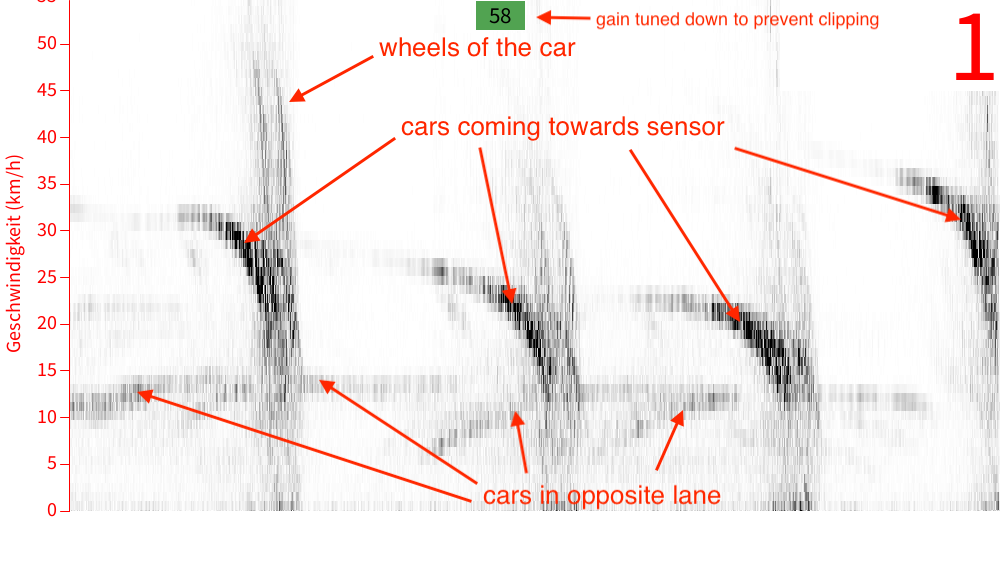

# Teensy Audio Board Prototype

This prototype works with the [IPS-354](https://media.digikey.com/pdf/Data%20Sheets/InnoSenT/200730_Data%20Sheet_IPS-354_V1.5.pdf) Radar Sensor from InnoSenT connected directly to the mic input of the [Teensy Audio Board](https://www.pjrc.com/store/teensy3_audio.html). The IPS-354 has a builtin gain of 27dB. The mic input of the audio board can regulate it's gain from 0 to 63dB. Together that's enough to detect cars, pedestrians and bicycles from the third floor of a building. When measured directly at the edge of the street the signal goes into clipping, so that the mic gain has to be set to about 55 to 58 dB. 

The teensy is programmed to continuously calculate a 1024 point FFT and transmit the data over Serial to the computer. The data are taken there by a [Processing](https://processing.org/) Script and visualized as a [waterfall diagram](https://en.wikipedia.org/wiki/Waterfall_plot). Additionally the Teensy calculates the frequency with highest amplitude which is optionally drawn as a line into the graph. This represents the mean speed of a moving object detected by the radar. 

The conversion from FFT bin to frequency is:

fft_bin_width = sample_rate/1024 = 44100 Hz/1024 = 43.0 Hz

The conversion from frequency to speed (at optimal angle, meaning the object comes directly onto the sensor) is:

speed = frequency/44

The Teensy also detects clipping with the `peak` function. If peak is returned as 1 the signal is in clipping. This is shown in the app as a green rectangle that turns red. With the <kbd>+</kbd> and <kbd>-</kbd> keys the gain can be regulated up or down to prevent clipping. Also the scale can be changed with the up and down arrows better see the lower speeds. You can also take a screenshot of the current view by pressing <kbd>s</kbd>.

Here a measurement done from 2m distance from the street edge. 

Here a measurement with a pedestrian up close where arm and leg movement can be seen in the signal. Cars are on the opposite side of the street and hence with fainter signal:

Here a measurement closer to the street with cars traveling both directions:	

## Wiring

| PS-354           | Audio Board | Teensy |
| ---------------- | ----------- | ------ |
| Pin 2 (enable)   | -           | Pin 22 |
| Pin 3 (Vcc)      | -           | Vcc    |
| Pin 4 (Gnd)      | Mic Gnd     | Gnd    |
| Pin 5 (signal I) | Mic         | -      |

